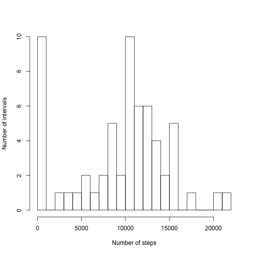
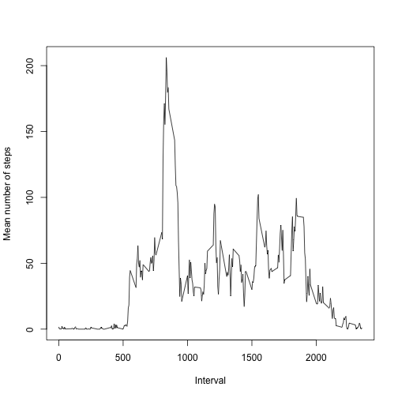
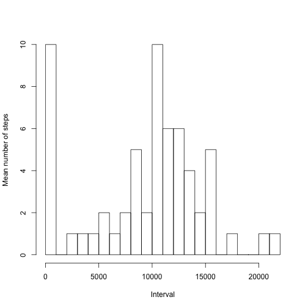
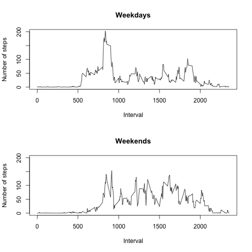

In this project, we practiced working with R markdown documents (.Rmd's) using "data from a personal activity monitoring device" that captures the number of steps taken by the individual wearing the device in 5-minute intervals (see the project description at https://github.com/rdpeng/RepData_PeerAssessment1).  The subheadings below are taken directly from the project description, to simplify evaluation of the resulting HTML document.  

## Loading and preprocessing the data

The following code chunk performs some preliminary operations, like deleting any existing data from R's memory, loading the dplyr package, reading in the data, and defining a constant that we will use later.  


```r
# Mise en place.  
rm(list = ls())
require(dplyr)

# Read in the data.  
data <- read.csv('activity.csv')

# Define how many intervals there are per day (number of minutes in each day
# divided by the number of minutes per interval).  
int.per.day <- 24* 60/ 5
```

## What is the mean total number of steps taken per day?

Having loaded in the data, we find the total number of steps that the person wearing the device took each day, and further calculate the mean and median number of steps that the person took over the period of measurement.  


```r
# Next, we use dplyr's group_by and summarize functions to determine the total 
# number of steps per day.  
group.date <- group_by(data, date)
total.steps.date <- summarize(group.date, sum.date = sum(steps, na.rm = TRUE))
hist(total.steps.date$sum.date, 20, main = '', xlab = 'Number of steps', ylab = 'Number of intervals')
```

 

```r
print(sprintf('The mean number of steps per day is %f', mean(total.steps.date$sum.date)))
```

```
## [1] "The mean number of steps per day is 9354.229508"
```

```r
print(sprintf('The median number of steps per day is %f', median(total.steps.date$sum.date)))
```

```
## [1] "The median number of steps per day is 10395.000000"
```

## What is the average daily activity pattern?

To examine the daily activity pattern of the person wearing the device, we group by 5-minute interval so that we can plot the mean number of steps that the person took at each of various times of day.  


```r
# Now, we group by interval so that we can make a plot of the mean number of 
# steps taken in each interval over the period of measurement.  
group.interval <- group_by(data, interval)
mean.steps.interval <- summarize(group.interval, mean.interval = mean(steps, na.rm = TRUE))
print(sprintf('The interval in which the maximum number of steps was taken, on average, was %i', as.numeric(mean.steps.interval[which(mean.steps.interval$mean.interval == max(mean.steps.interval$mean.interval)), 1])))
```

```
## [1] "The interval in which the maximum number of steps was taken, on average, was 835"
```

```r
plot(mean.steps.interval$interval, mean.steps.interval$mean.interval, type = 'l', xlab = 'Interval', ylab = 'Mean number of steps')
```

 

## Imputing missing values

As noted in the project description, the data set contains quite a number of missing values: 


```r
# How many missing values are there?  
print(sprintf('The number of missing values (NAs) is %i', sum(is.na(data$steps))))
```

```
## [1] "The number of missing values (NAs) is 2304"
```

To fill in these values, I decided to substitute the mean for the day on which each NA value occurred.  Because simply summarizing using the mean produced more NAs, I used the total and divided by the number of intervals per day, 


```r
# Filling in missing data.  For helpful posts on this subject, see
# https://class.coursera.org/repdata-015/forum/thread?thread_id=46#post-197
# https://class.coursera.org/repdata-015/forum/thread?thread_id=83#post-347
# https://class.coursera.org/repdata-015/forum/thread?thread_id=35#comment-232
fill.data <- data
dates <- unique(data$date)
for (i in 1: length(dates)) {
  fill.data[which(fill.data$date == as.character(dates[i]) & is.na(fill.data$steps)), 1] <- total.steps.date[total.steps.date$date == as.character(dates[i]), 2]/ int.per.day
}
fill.group.date <- group_by(fill.data, date)
fill.total.steps.date <- summarize(fill.group.date, sum.date = sum(steps, na.rm = TRUE))
```

This procedure doesn't work very well, because it just substitutes 0's for the values that were previously ignored using na.rm = TRUE.  We obtain the same answers as before.  (It should be noted that this strategy is suggested as a possibility by the project description.  Substituting the mean values from each interval would likely work much better.)  


```r
# not very effective -- same results as before
hist(fill.total.steps.date$sum.date, 20, main = '', xlab = 'Interval', ylab = 'Mean number of steps')
```

 

```r
print(sprintf('The mean number of steps per day after filling is %f', mean(fill.total.steps.date$sum.date)))
```

```
## [1] "The mean number of steps per day after filling is 9354.229508"
```

```r
print(sprintf('The median number of steps per day after filling is %f', median(fill.total.steps.date$sum.date)))
```

```
## [1] "The median number of steps per day after filling is 10395.000000"
```

## Are there differences in activity patterns between weekdays and weekends?

Now, we investigate whether the person wearing the device behaved differently (took different numbers of steps during various times of day) during the weekends as opposed to weekdays.  


```r
# find out which weekdays, 'Mon', 'Tue',... each day in the study corresponds 
# to, and assign them to a weekday or weekend class
days.of.week <- weekdays(as.POSIXct(dates), abbreviate = TRUE)
weekday.weekend <- rep('weekday', length(days.of.week))
weekday.weekend[which(days.of.week == 'Sat')] <- 'weekend'
weekday.weekend[which(days.of.week == 'Sun')] <- 'weekend'

# make a vector with the same length as the columns in fill.data
new.factor <- rep(NA, length(fill.data$date))
for (i in 1: length(dates)) {
  new.factor[which(fill.data$date == as.character(dates[i]))] <- weekday.weekend[i]
}

# add the new factor to fill.data
fill.data <- mutate(fill.data, typeofday = new.factor)
fill.group.interval.typeofday <- group_by(fill.data, typeofday, interval)
fill.mean.interval.typeofday <- summarize(fill.group.interval.typeofday, mean.steps = mean(steps))

# and, plot the results in terms of mean number of steps per interval on weekdays
par(mfrow = c(2, 1))
plot(fill.mean.interval.typeofday$interval[which(fill.mean.interval.typeofday$typeofday == 'weekday')], fill.mean.interval.typeofday$mean.steps[which(fill.mean.interval.typeofday$typeofday == 'weekday')], type = 'l', ylim = c(0, 200), main = 'Weekdays', xlab = 'Interval', ylab = 'Number of steps')
plot(fill.mean.interval.typeofday$interval[which(fill.mean.interval.typeofday$typeofday == 'weekend')], fill.mean.interval.typeofday$mean.steps[which(fill.mean.interval.typeofday$typeofday == 'weekend')], type = 'l', ylim = c(0, 200), main = 'Weekends', xlab = 'Interval', ylab = 'Number of steps')
```

 

There is a clear peak in activity before midday in the Weekdays panel that doesn't show up in the Weekends panel.  Perhaps the person wearing the device goes for a walk or a run before lunch on weekdays, but not weekends?  
